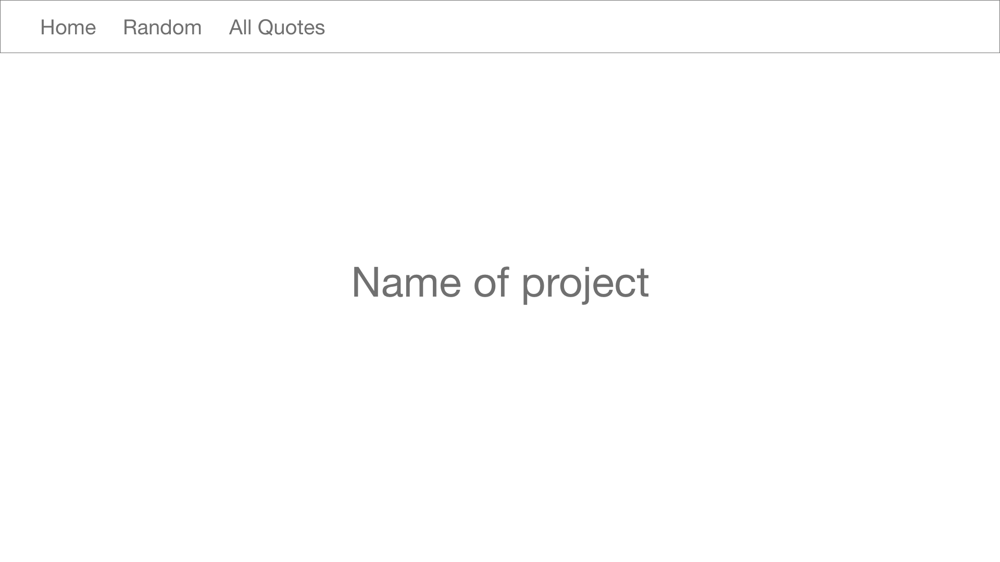
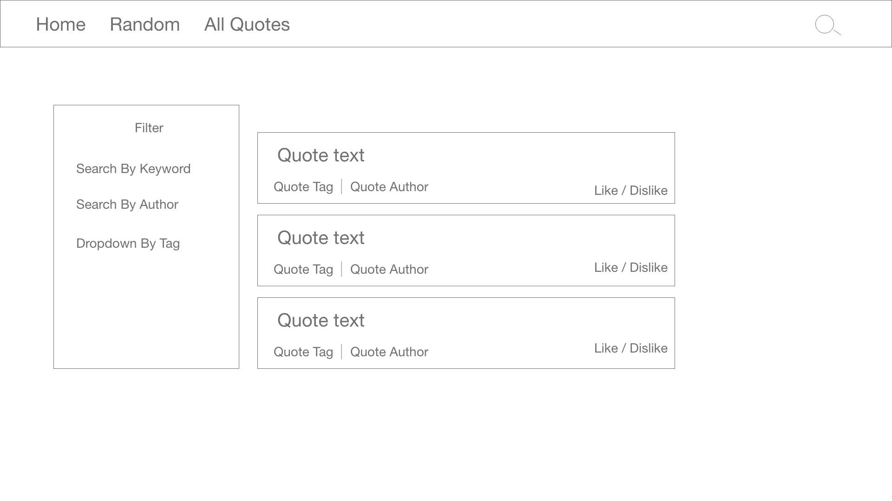
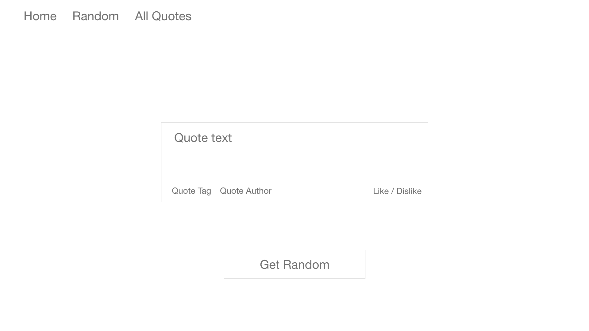
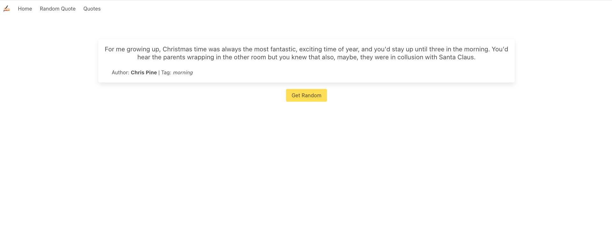

#  Project #2: Reacathon

## Quotetionary 

### Summary

The assignment was to create a react app rendered in a web browser, with data consummed from a public API, in a team of 2.

For the MVP version, we choose to make a quote bank app, with the following features supported:
- Users can pull a single random quote.
- Filter quotes by:
  - Tag
  - Author 

Stretch goals/additional features to be built upon the MVP:
- Search by keyword
- Like/Dislike button
  - Where 'Like' adds more quotes from the same author, displayed at the top of all the quotes.
  - Where 'Dislike' removes the quote to be displayed.
- Pick random quote from selected tag.
- Consolidate current API data with an additional API to augment UX.

Once that the scope of our tasks was defined, we proceeded to build wireframes.

#### Landing Page

#### Quotes Pages

#### Random Quote Page


### Technologies
- HTML
- SCSS
- Javascript/JSX
- React
- Git & GitHub

### Libraries
- Bulma Framework
- Axios

### API Documentation
[GoQuotes API](https://goquotes.docs.apiary.io/#)

### Functionnalities

#### Filter
We added a filter section inside the quotes page, the user can filter by author & tag. To achieve this we had a filteredArray that was a copy of the allQuotes array but with filtered items, then we rendered the filtered array inside react.
```js
  const handleChange = e => {
    setSearchForm({ ...searchForm, [e.target.name]: e.target.value })
  }
  function filterQuotes(originalQuotes) {
    const filteredTag = originalQuotes.filter(quote => {
      return (
      quote.tag === searchForm.tag 
      || searchForm.tag === 'All')
    )
    }
    const filteredAuthor = filteredTag.filter(quote => {
     return (
        quote.author.toLowerCase().includes(searchForm.searchField.toLowerCase()) 
        || searchForm.searchField === '')
     )
    }
    setFilteredQuotes(filteredAuthor)
    return filteredAuthor
  }
```
As you can see in the code above, we check for if the tag or author matched and if they did we would return the quote, also we would return if the tag was 'All' or the author search term was empty.

### Get/Display Random Quote
For the random quote we picked a number between 0 and the quotesArray length as the index and choose the item with the same index from the quotesArray as the choosen randomQuote.
```js
  const [randomQuote, setRandomQuote] = React.useState(
    !!quotesArray &&
    quotesArray[Math.floor(Math.random() * quotesArray.length)])
  const handleClick = () => {
    setRandomQuote(quotesArray[Math.floor(Math.random() * quotesArray.length)])
  }
```

### In-app Screenshots



### Lessons Learnt
We could have done a better job at planning tasks for each person during this project.
Collaboration tools are very important and effect workflow of the team. 
Console log a lot it's the best way to debug your application. 
Making multiple API calls was a bit confusing, we had a few problems with that but we got it working in the end.
We wanted to make as less API calls as we could so we loaded the data in APP.js and saved it to local storage. 
### Credits
[API](https://goquotes.docs.apiary.io/) used is called GO Quotes, it's an open source API that provides quotes.
[Axios](https://bulma.io/documentation/overview/) Bulma is a free, open source framework that provides ready-to-use frontend components that you can combine to build responsive web interfaces.